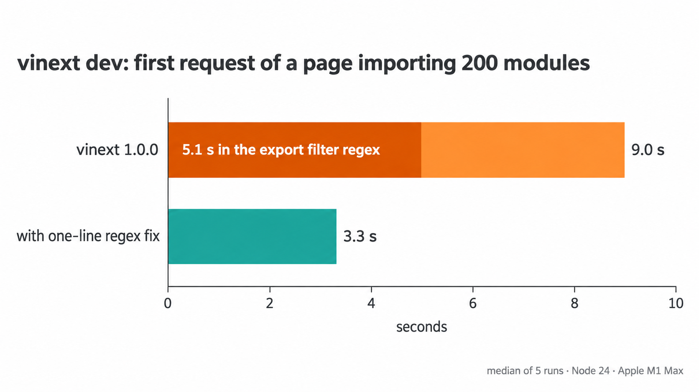

# vinext dev: the `export *` filter regex is quadratic

**vinext 1.0.0 runs `/\bexport\b[\s\S]*\*/` over every module in dev, in the client and the SSR environment.**
When a module has many `export`s and no `*` after them, each `export` scans to the end of the file and back.
The cost grows with the square of the module size.

In this repro the first request to a page that imports 200 such modules takes 9.0 s. The regex takes 5.1 s of it.
With the [one-line patch](patches/vinext-1.0.0-export-all-filter.patch) the request takes 3.3 s, and the regex takes 5 ms.



## Repro

```sh
npm i
npm run compare    # about 2 minutes
npm run regex      # the regex alone, no Vite
npm run fuzz       # the proposed regex against hasExportAllCandidate
```

`compare` generates the app, then starts the dev server 12 times: one warm-up and 5 measured runs for each variant, alternating.
Each run requests `/`, then loads every client module the page imports, 6 at a time, as a browser does.
It also times every call of the filter regex, and checks that both variants still reject `export *` in a page.

## Numbers

A page that imports 200 modules. Each module has 400 lines like `export const label_0_1 = "module 0, entry 1";` (19 KB, no `*`).

| vinext 1.0.0 | first HTML | client modules | time in filter regex | filter calls |
|---|---:|---:|---:|---:|
| shipped | 8976 ms | 755 ms | 5132 ms | 557 |
| patched | 3280 ms | 756 ms | 5 ms | 557 |

Median of 5 runs. Both variants reject `export * from` and `export /* comment */ * from` in a page.

The regex alone on one module (`npm run regex`, median of 7):

| exports | size | shipped regex | proposed regex |
|---:|---:|---:|---:|
| 100 | 5 KB | 0.69 ms | 0.002 ms |
| 200 | 10 KB | 2.93 ms | 0.003 ms |
| 400 | 19 KB | 11.76 ms | 0.007 ms |
| 800 | 39 KB | 46.86 ms | 0.013 ms |
| 1600 | 79 KB | 191.82 ms | 0.025 ms |
| 3200 | 160 KB | 779.10 ms | 0.052 ms |

Twice the exports, four times the time.

A large Pages Router app (~4,300 server modules) showed 8.2 s of self time in this regex during the first dev request.

## Cause

The [`vinext:validate-page-exports`](https://github.com/cloudflare/vinext/blob/ca67493fb4f4599dedd55b10e56808424371de6a/packages/vinext/src/index.ts#L7046-L7067) plugin (1.0.0; the regex is the same on `main`) rejects `export * from` in pages. Its transform has a `code` filter:

```js
filter: { id: { exclude: VIRTUAL_MODULE_ID_RE }, code: /\bexport\b[\s\S]*\*/ },
handler(code, id) {
  if (this.environment?.name !== "client") return null;
  if (!hasPagesDir || !hasExportAllCandidate(code)) return null;
  // only page files inside pages/ go on
```

Vite tests the `code` filter on every module before it calls the handler, in every environment.
`[\s\S]*` is greedy. For each `export`, it runs to the end of the file, then backs up one character at a time looking for `*`.
With no `*` after the exports, the regex fails only after doing that for every `export`.

A `*` near the end of the file makes the match fast. A `/** license */` header at the top does not help.

## Fix

```diff
-code: /\bexport\b[\s\S]*\*/
+code: /\bexport\s*[*/]/
```

The filter only decides whether the handler runs. The handler then calls `hasExportAllCandidate`, which accepts `export`, then whitespace and comments, then `*`.
So after `export` and optional whitespace, the next character is `*` or the `/` that starts a comment.
The new regex matches every input `hasExportAllCandidate` accepts, and it only looks at the characters right after each `export`.
A fuzz run (`npm run fuzz`) of 500,000 random strings found no input where `hasExportAllCandidate` returns true and the new regex does not match.

[`scripts/patch.mjs`](scripts/patch.mjs) applies the change to the published `dist/index.js` for `compare`, and restores the original after.

## Manual steps

```sh
npm run generate -- 200 400   # modules, exports per module
npm run dev                   # open the page; vinext logs the first request time
npm run patch                 # or npm run unpatch; restart the dev server
```

## Environment

vinext 1.0.0, vite 8.3.0, rolldown 1.2.12, react 19.2.8, Node 24.13.0, macOS 26.6, Apple M1 Max.
